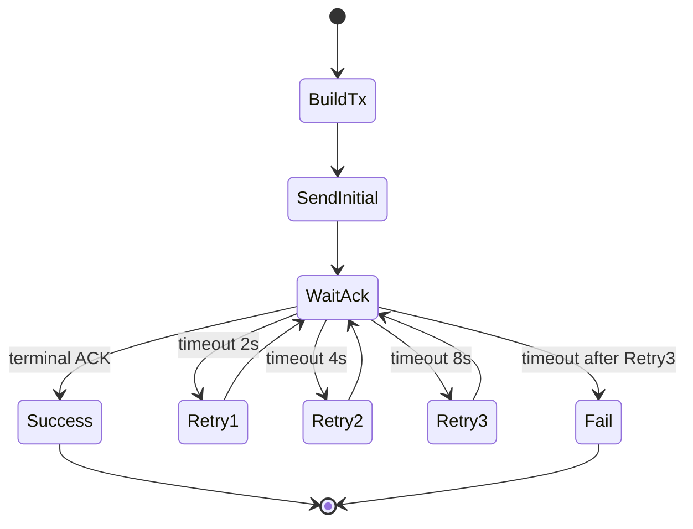
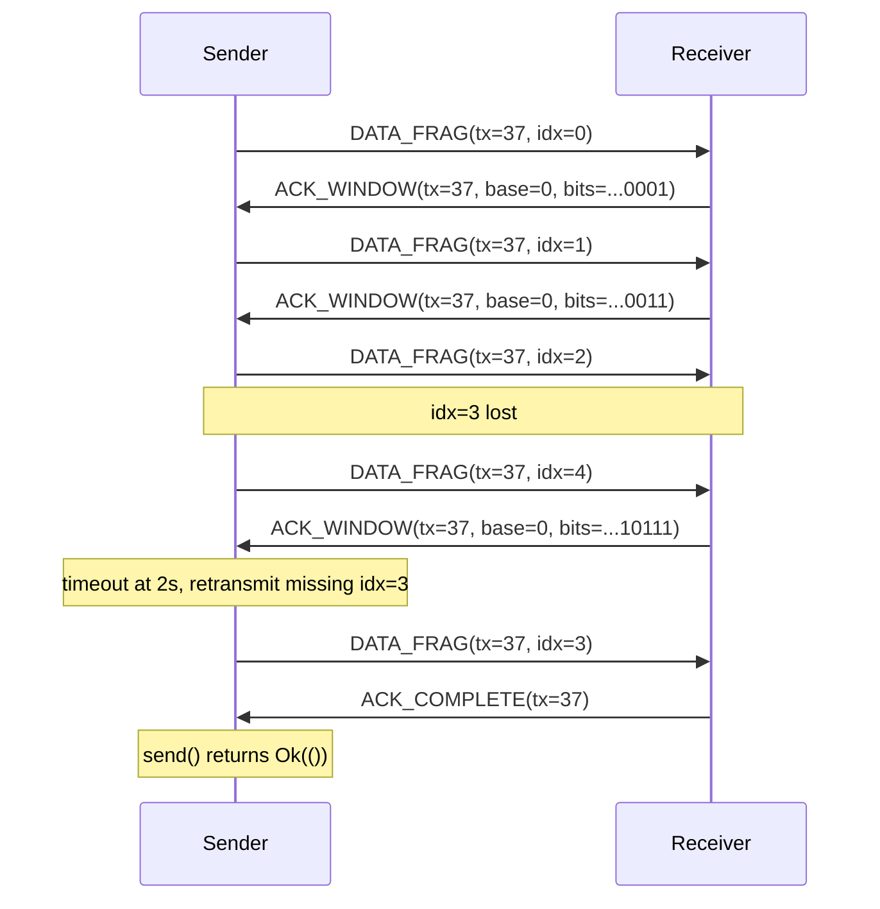

# Fairly Reliable Packet Transport (FRPT) Specification

## 1. Purpose

This document specifies a reliability and fragmentation layer to sit **between Engine and DTLS**.

Goals:

- Support `send(block)` where `block.len() <= PACKET_MAX`.
- Provide reliable delivery with ACK-driven completion.
- Fragment/reassemble blocks to fit UDP packet MTU.
- Handle out-of-order packet arrival.
- Keep binary overhead small.

Definitions:

- `block`: application payload passed to `PacketTransport::send`.
- `packet`: one UDP payload sent via DTLS, always `<= MTU`.

Constants:

- `PACKET_MAX = 64 * 1024 * 1024` bytes (64 MiB).

## Implementation status in this branch

Implemented now:

- `DATA_SINGLE` framing for blocks that fit in one packet (`block.len() <= mtu - 4`).
- `ACK_COMPLETE` handling for single-packet sends.
- Duplicate suppression for `DATA_SINGLE` by `(peer, tx_id)`.

Not yet implemented (large-packet path):

- `DATA_FRAG` send path for multi-packet blocks.
- `ACK_WINDOW` generation/processing.
- Fragment reassembly state machine and completion for large blocks.
- Fragment retransmit/windowed retry behavior for large blocks.

This document includes the full target protocol; sections describing fragmented large-packet behavior remain the intended next implementation stage.

---

## 2. Placement and Integration

### 2.1 Layering

```text
Engine
  -> PacketTransport (new trait)
      -> DtlsReliablePacketTransport (new implementation)
          -> Dtls (existing)
              -> UDP
```

### 2.2 Engine integration

- `Engine` constructs `DtlsReliablePacketTransport` with owned `Dtls` + required `mtu`.
- `Engine` replaces `self.dtls.send(...)` call sites with `self.packet_transport.send(...)`.
- DTLS inbound callback delegates to `packet_transport.handle_message(...)`.
- `packet_transport` delivers fully reassembled blocks upward (equivalent to current DTLS message delivery contract).

### 2.3 Trait/API sketch

```rust
pub trait PacketTransport {
    fn send(&self, to: &NetworkEndpoint, block: &[u8]) -> Result<(), String>;
    fn handle_message(
        &self,
        from: &NetworkEndpoint,
        issuer: &str,
        packet: &[u8],
    ) -> Result<Option<Vec<u8>>, String>;
}

pub struct DtlsReliablePacketTransport {
    // owns DTLS instance
}

impl DtlsReliablePacketTransport {
    pub fn new(dtls: Box<dyn Dtls + Send + Sync>, mtu: usize) -> Result<Self, String>;
    pub fn set_mtu(&mut self, mtu: usize) -> Result<(), String>;
    pub fn mtu(&self) -> usize;
}
```

Notes:

- `mtu` is mandatory on construction (no optional/default MTU).
- `set_mtu` is allowed at runtime, applied to new sends.

---

## 3. Protocol Overview

FRPT introduces a small binary header inside DTLS application data.

Packet types:

1. `DATA_SINGLE` — one-packet block.
2. `DATA_FRAG` — one fragment of a multi-packet block.
3. `ACK_WINDOW` — selective ACK for a fragment window.
4. `ACK_COMPLETE` — terminal ACK: full block received and accepted for upper-layer delivery.

Reliability model:

- Sender retries with exponential schedule: `2s`, `4s`, `8s`, then fail.
- `send(...)` returns success only after terminal `ACK_COMPLETE`.
- `ACK_WINDOW` is advisory progress for fragment reception; it does not complete a send.

---

## 4. Binary Format

All integers are **big-endian**.

### 4.1 Common prefix (4 bytes, present in every FRPT packet)

| Bytes | Field | Type | Description |
|---|---|---|---|
| 0 | `ver_type` | `u8` | High nibble = protocol version (currently `1`), low nibble = packet type |
| 1 | `flags` | `u8` | Type-specific flags |
| 2..3 | `tx_id` | `u16` | Transfer identifier (per sender->peer direction) |

Type codes:

- `0x1`: `DATA_SINGLE`
- `0x2`: `DATA_FRAG`
- `0x3`: `ACK_WINDOW`
- `0x4`: `ACK_COMPLETE`

### 4.2 `DATA_SINGLE`

Header size: `4` bytes (common prefix only)

Payload: complete block data.

Constraint:

- `payload_len <= mtu - 4`

### 4.3 `DATA_FRAG`

Header size: `12` bytes

| Bytes | Field | Type | Description |
|---|---|---|---|
| 0..3 | common | — | Common prefix |
| 4..5 | `frag_index` | `u16` | Fragment index, `0..frag_count-1` |
| 6..7 | `frag_count` | `u16` | Total fragments in this block (`>= 2`) |
| 8..11 | `block_len` | `u32` | Original block length in bytes |

Payload: bytes for this fragment.

Constraints:

- `block_len <= PACKET_MAX`.
- `frag_count <= 65535`.
- `frag_payload_max = mtu - 12`.

### 4.4 `ACK_WINDOW`

Header size: `14` bytes

| Bytes | Field | Type | Description |
|---|---|---|---|
| 0..3 | common | — | Common prefix |
| 4..5 | `base_index` | `u16` | Start fragment index represented by mask |
| 6..13 | `ack_bits` | `u64` | Bit `n` means `frag_index = base_index + n` received |

Semantics:

- Selective ACK for up to 64 fragments.
- Can be sent repeatedly as receiver state evolves.

### 4.5 `ACK_COMPLETE`

Header size: `4` bytes (common prefix only).

Semantics: receiver has complete block and has accepted it for upper-layer delivery.
This is the only terminal ACK type for both `DATA_SINGLE` and `DATA_FRAG` transfers.

---

## 5. Sender Behavior

### 5.1 Pre-checks

- Reject `block.len() > PACKET_MAX`.
- Reject invalid `mtu` (`mtu` must be `> 1024` and large enough for required header).
- Allocate next `tx_id` (u16, wrapping).

### 5.2 Single-packet send

If `block.len() <= mtu - 4`:

1. Send one `DATA_SINGLE` packet.
2. Wait for `ACK_COMPLETE` matching `tx_id`.
3. Retry same `DATA_SINGLE` after `2s`, `4s`, `8s` if no terminal ACK.
4. Fail after 3 timeouts.

### 5.3 Fragmented send (planned, not yet implemented)

If block needs fragmentation:

1. Split block into `frag_count` fragments with payload `<= mtu - 12`.
2. Send fragments using a fixed in-flight window of `64` fragments.
3. Track ACKed fragments from incoming `ACK_WINDOW` packets.
4. Advance window as fragments become ACKed.
5. On timeout (`2s`, `4s`, `8s`): retransmit all currently unacked fragments in in-flight window.
6. Complete only when `ACK_COMPLETE` received.
7. Fail after third timeout without completion.

Rationale:

- Windowed selective ACK avoids retransmitting entire 64 MiB block on sparse loss.
- Simpler than TCP: no byte-stream semantics, no congestion algorithm in v1.

---

## 6. Receiver Behavior

### 6.1 General rules

- Parse and validate FRPT header before any upper-layer processing.
- Ignore packets with unknown version/type.
- ACK generation happens **before** upper-layer message handling.

### 6.2 `DATA_SINGLE`

1. Immediately send `ACK_COMPLETE`.
2. Deliver payload block upward.
3. Cache `(peer, tx_id)` completion for duplicate suppression.

Duplicate `DATA_SINGLE` handling:

- Re-send `ACK_COMPLETE`.
- Do not re-deliver block.
- Rationale: duplicate `DATA_SINGLE` usually means prior terminal ACK was lost; re-sending terminal ACK stops sender retries without duplicating delivery.

### 6.3 `DATA_FRAG` (planned, not yet implemented)

1. Upsert reassembly context keyed by `(peer, tx_id)`.
2. Validate `frag_count`, `frag_index`, `block_len`, and metadata consistency across fragments.
3. Store fragment (out-of-order allowed).
4. Send `ACK_WINDOW` for corresponding 64-fragment region.
5. When all fragments present:
   - Reassemble full block.
   - Send `ACK_COMPLETE`.
   - Deliver full block upward.
   - Mark transfer complete in duplicate cache.

Duplicate fragment handling:

- Re-send `ACK_WINDOW` reflecting current state.
- Do not duplicate stored fragment content.

### 6.4 Expiry and resource protection

- Reassembly context timeout: `30s` since first fragment (configurable).
- On timeout: drop partial context.
- Enforce caps:
  - max in-progress transfers per peer,
  - max global reassembly bytes,
  - reject any transfer metadata implying `> PACKET_MAX`.

---

## 7. ACK and Retry Timing

### 7.1 Sender retry schedule (mandatory)

- Retry #1 at `+2s`
- Retry #2 at `+4s`
- Retry #3 at `+8s`
- Then `FAIL`

### 7.2 Receiver ACK timing

- `DATA_SINGLE`: send `ACK_COMPLETE` immediately.
- `DATA_FRAG`: send `ACK_WINDOW` immediately or coalesced up to `25ms` max.
- `ACK_COMPLETE`: send immediately upon full reassembly.

---

## 8. State Machines

### 8.1 Sender (simplified)



### 8.2 Fragmented transfer sequence



---

## 9. Packet Layout Diagrams

### 9.1 `DATA_FRAG` (12-byte header)

```text
0               7 8             15 16                           31
+----------------+----------------+------------------------------+
| ver |  type    |     flags      |            tx_id             |
+----------------+----------------+------------------------------+
|          frag_index             |           frag_count         |
+---------------------------------------------------------------+
|                         block_len (u32)                        |
+---------------------------------------------------------------+
|                         fragment payload ...                   |
+---------------------------------------------------------------+
```

### 9.2 `ACK_WINDOW` (14-byte header)

```text
0               7 8             15 16                           31
+----------------+----------------+------------------------------+
| ver |  type    |     flags      |            tx_id             |
+----------------+----------------+------------------------------+
|          base_index             |       ack_bits[63:48]        |
+---------------------------------------------------------------+
|                       ack_bits[47:16]                          |
+---------------------------------------------------------------+
|       ack_bits[15:0]            |
+---------------------------------+
```

---

## 10. Error Handling Rules

- Invalid packet structure/length: drop silently.
- Version mismatch: drop silently (future compatibility).
- Conflicting metadata for same `(peer, tx_id)`: drop transfer context.
- Completed transfer receives duplicate data: ACK again, no re-delivery.
- Sender timeout exhaustion: `send` returns `Err("reliable send timeout")`.

---

## 11. RFC / Standard Reuse Assessment

Candidates considered:

- RFC 4960 SCTP / RFC 8261 SCTP-over-DTLS
  - Reliable + fragmentation available, but significantly larger protocol surface and implementation complexity than required.
- RFC 7959 CoAP Block-Wise Transfer
  - Good conceptual match for block fragmentation, but tied to CoAP message model/options and not a direct fit for Bingle payload transport.
- QUIC
  - Rich reliability/congestion features, but excessive integration and overhead for this narrow layer.

Decision:

- Implement a custom minimal binary header protocol (`FRPT`) tailored to Bingle requirements.
- Keep frame types and state machine intentionally small while meeting ACK/retry/fragmentation requirements.

---

## 12. Implementation Checklist (status)

- [x] Add `PacketTransport` trait.
- [x] Implement `DtlsReliablePacketTransport` with owned DTLS instance.
- [x] Add mandatory MTU constructor parameter and setter.
- [x] Wire Engine send/receive paths to transport.
- [x] Add test coverage for single packet terminal ACK (`ACK_COMPLETE`).
- [x] Add test coverage for duplicate suppression.
- [x] Add test coverage for timeout failure path.
- [ ] Implement fragment out-of-order reassembly.
- [ ] Implement selective ACK (`ACK_WINDOW`) + retransmit for fragmented transfers.
- [ ] Add explicit `PACKET_MAX` boundary coverage.
