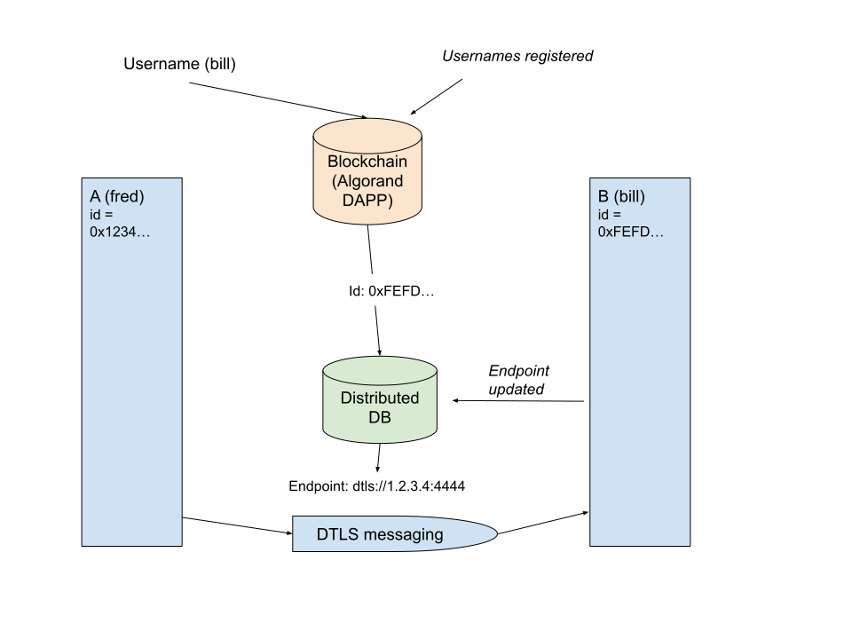

Bingle Protocol Spec
====================

# Overview

Bingle is a protocol for secure, decentralised, distributed messaging.

Each Bingle node has an identifier (an Algorand address, which is based on an ed25519 public key)
and is associated with a unique user generated `handle`.

Typically, a user will send a message to a handle, and will receive messages addressed to their own handle.
A Bingle API provides this functionality to an application on a device.

Nodes and handles are registered on the Algorand blockchain. This also provides a TLS compatible PKI to facilitate secure end to end encrypted messaging.

Where a node is able to get a reasonably persistent IP address (this is driven by the NAT implemntation of the node's internet connection), the node can receive messages directly using a DTLS endpoint.
The IP address is advertised in a distributed database, allowing a node to determine the endpoint for an id.
Where a node is unable to get a persistent IP address, it can use a relay (based on TURN) to receive traffic. In this case the relay endpoint is advertised.
The protocol is extensible to support other transports, potentially TOR.

Registering a user into Bingle requires a small fee, paid in Algo (this is in addition to Algo transaction costs).

Users can opt to run a regular or a relay node. The latter provides relay functionality and the distributed DB.
There is a financial incentive to operate a relay node - based on availabiliuty and reliability, operators will be credited Algo.

# Interactions

## Handle lookup

This is initiated by a Bingle API call `handleLookup(handle) => id`.

The prerequisite for this is that the node has been initialized.
It will lookup the `handle` in the Algorand blockchain and return the associated `id`.
If multiple entries exist, we want the *oldest* one. This is to ensure handle uniqueness.
(This version does not support changing a handle).
If no entry is found, we want to return NULL/Fail.

The handle is a text string with the following constraints:
- uppercase is treated as lowercase
- non-alphanumeric characters are ignored

e.g: `Fred123` => `fred123`
`James.Jones` => `jamesjones`
`james-jones` => `jamesjones`
`#user$100` => `user100`

The handle value is stored in the registered form and compared in the normalised form.

Steps for this are as follows:

- get or create a blockchain (Algorand) connection
- search the local state (using the indexer) for each account opted into the Bingle application
- filter this to entries where `Handle` equals the `handle` parameter
- return the oldest entries `id` based on `HandleTime`
- if no entry is found, return NULL/Fail

## Outgoing message transfer

This implements six methods:

When we have the `id`, and don't need a response, use `sendMessageToId(userId, message, progressCallback) => boolean`

When we have a `handle`, and don't need a response, use `sendMessageToHandle(handle, message, progressCallback) => boolean`

When we have both the endpoint `NetworkSourceKey` and the `id` use `sendMessageToNetwork(networkSourceKey, userId, message, progressCallback) => boolean`

When we have the id and need a response, use `sendMessageToIdWithResponse(userId, message, progressCallback) => Response`

When we have a handle and need a response, use `sendMessageToHandleWithResponse(handle, message, progressCallback) => Response`

When we have both the endpoint `NetworkSourceKey` and the `id` and need a response, use `sendMessageToNetworkWithResponse(networkSourceKey, userId, message, progressCallback) => Response`

The prerequisite for this is that the node has been initialized.

Steps are as follows:

- if we have a handle, use `handleLookup` to get the `id` _(sendMessageToHandle/sendMessageToHandleWithResponse)_
- if we don't have a `NetworkSourceKey`, look it up as follows: _(sendMessageToHandle/sendMessageToId/sendMessageToHandleWithResponse/sendMessageToIdWithResponse)_
  - (see Distributed Database section below)
  - find our relay to use
  - send a `DdbQueryResolve` message to the relay with our `id`
  - await the `DdbQueryResponse` message with the endpoint details in the `advertRecord`
- if we have a direct DTLS endpoint, use it to send our message over DTLS
- if we have a relay endpoint, send the message as described in the Relay DTLS section below
- if we need a response, wait for this (see Incoming message transfer)

At each stage, call the progress callback with the current progress (if one has been provided).

For versions requiring a response, the response is a `Response` command object, (see command reference below).

## Incoming message transfer

This is initiated by a message being received by direct DTLS or relayed DTLS.

The DTLS layer will have validated the `id` of the message sender and decrypted the message.

If the message has a `tag`, it will be matched to the `responseTag` sent on the request. If matched, the requests wait will finish and it will return the response message.

Otherwise, if the message is not a `PlainTextMessage`, it will be passed to a handler selected by the type value.

For a `PlainTextMessage` an `onMessage` callback in the API will be used to notify message arrival.

### Direct DTLS

Direct DTLS uses an on-demand DTLS connection.

This is expected to decide dynamically whether to send as a client (when no connection already exists) or a server (when an inbound connection has been established).

The DTLS protocol uses the Algorand blockchain to facilitate a serverless PKI.

Each `id` is a registered Algorand address which is opted in to the Bingle DAPP.
The DTLS implementation MUST check that the `id` is opted in to the Bingle DAPP and has a `Handle` field in local storage.

The end-entity certificate has the `id` stored in the subject CN with a suffix of "." 
(e.g. \<address\>.). This minimal suffix is used because the 58-character Algorand address plus a standard URI suffix would exceed the 64-character limit for X.509 Common Name fields.

The CA certificate is signed using the Algorand (ed25519) private key, ensuring that only the owner of the `id` can sign.

Server and client certificates use the EC (NIST P-256) algorithm for signing, and the DTLS protocol uses ECDHE for key exchange.
They are signed by the CA private key. Their private keys are generated for each connection and deleted afterwards.

This process enables secure message delivery between DTLS endpoints with encryption and identity verification.

### Relay DTLS

Relay DTLS uses a relay server to establish a DTLS connection.
This uses the TURN protocol's encapsulation of UDP, but with a different setup process using Bingle messages.

The system of relay servers starts with the root relay servers. These have static IP addresses and are known to be reliable. The endpoints for these are available from the blockchain.

Other relay servers are provided by users and can have dynamic IP addresses (but must support full cone NAT or direct IP).

At initialization, a node obtains a list of relay servers and determines its preferred servers
(based on partition of the 32 bit Algorand address space by the number of relays).
When relay servers are added or removed, the epoch changes and the preferred servers are recalculated.

When at initialization or network change time, a node determines that it has not full cone or direct IP, it will use a relay server.

It then issues a `Listen` message to the preferred relay server. 
The relay endpoint is then advertised in the distributed database.

When a node wishes to send a message to a relayed node, it sends a `Call` message to the relay server.
This allocates a TURN channel.
The relay server then notifies the called node with a `RelayCalled` message containing the channel number.
The relay responds to the caller with a `RelayCallResponse` message containing the channel number to use.
DTLS UDP traffic can then be encapsulated in TURN `ChannelData` messages sent to the relay server.
Return traffic is encapsulated in the same way on the same channel.

Note that the TLS connection is above the TURN layer. This ensures that the relay server cannot introspect messages and that end-to-end encryption and identity are preserved.

## Initialisation and advertisement

Initialization involves the following steps, which are expanded below:

- establish a connection with an Algorand node (indexer and algod API).
- find our assigned relay servers
- determine the internet connection type and endpoint address if available
- if we have a direct connection:
  - advertise our direct endpoint to the distributed database
- if we have a restricted NAT or symmetric NAT connection:
  - issue a `Listen` message to the preferred relay server and wait for response
  - advertise our relay endpoint to the distributed database

We can now send messages to other nodes and receive incoming messages.

## Algorand node connection

In order to read and write on the Algorand blockchain, we need to establish a connection to a node.
This can be provided by a local node or an API provider. Typically, we will supply endpoint and access details to an Algorand API wrapper for our implementation language and platform.

## Finding relay servers

We start by finding the root relay servers. These are known to be reliable, have static IP addresses and have their ids and IP addresses listed on the blockchain.
The Bingle DAPP has local state for each root relay server. To find all root relay servers, use the indexer API to scan local state and extract entries where `RelayIP` is set.
Then, make a list of relays with their id (Algorand address) and `RelayIP` value.

We can then find our preferred root relay server as follows:
- if we have only one root relay server, use it
- otherwise:
  - sort the list of root relays by `id`
  - partition the list by the number of root relays
  - each partition will have a size of `2^32 / number_of_root_relays`
  - find the partition that contains our `id`. The index of this `pref_idx` will be the index of our root relay.

The alternate root relay server will be at `(pref_idx + 1) % number_of_root_relays`

We can then call `RelayCheck` on the prime server to check it is available, and if not try the alternate.

Now we can find other non-root relay servers by sending a `DdbGetEpoch` to the root relay server.
This will return a `DdbEpochInfo` with a list of server ids for all relay servers.

Using the above partitioning algorithm on the full list of relay servers, we can obtain the `id` of the preferred relay server and the IP endpoint.

We can again use `RelayCheck` to check the relay is available, and if not try the alternate.

This provides us with the IP address and id of the preferred relay server.

## Finding internet connection

This involves using STUN to determine which IP address and port an outgoing UDP packet is sent on, and then validating that this is the same for all other IP endpoints, not just the STUN server.

(Note, an implementation might allow for this to be bypassed and an IP address and port configured, for instance where we have a relay with a static IP connection).

For STUN, we will have configured a list of publicly available STUN servers.
We also have a filter such that when a STUN message (identified by the first byte of data being in the range 0 to 3) is received, we handle it as STUN rather than DTLS.
We send STUN requests out to each of our configured STUN servers in turn at a limited cadence, avoiding sending a request when one remains outstanding to the same server.
When we receive STUN responses, we extract the IP address and port from the response.
We can then analyse the set of responses and determine when we have more than one response and that they have returned the same endpoints (CONSISTENT)
or different endpoints (INCONSISTENT).

Inconsistent responses indicate that we have a symmetric or restricted cone NAT.

Consistent responses indicate that we *may* have a full cone NAT.

In the latter case, we need to validate this endpoint address and port using a triangular ping test.

We send a `RelayTriangleTest1` message to our selected relay server.
The relay responds with a `RelayTriangleTest1Response`.
If `noCornerNode` is true, it indicates that no corner node was available for the test and the receiver should assume restricted/symmetric NAT.
Otherwise, the relay will send a `RelayTriangleTest2` message to a peer relay server (the next one in the relay graph).
This server will then send us a `RelayTriangleTest3` message.
Receipt of this indicates that we have a full cone NAT.

If we didn't receive this response in a reasonable interval, we can assume symmetric or restricted cone NAT.

Otherwise, we have full cone NAT and our endpoint address and port are valid.

## Advertising endpoints

Once we have a relay or direct endpoint, we can advertise it to the distributed database.

This involves populating an `AdvertRecord` with the `id` and `NetworkSourceKey` 
and sending a `DdbUpsertResolve` message containing this to our preferred relay server.

## Registration

Registration involves creating a new `id`, registering it with the Algorand blockchain (by funding that address) and opting into the Bingle DAPP.
The app will need to receive funding of the Bingle fee in Bingle$.

Once this is done, any data signed with the `id` can be regarded as coming from the creator user (or anyone with their private key).

## Network change detection

A network change can be detected by continually verifying STUN responses and validating that either the responses are inconsistent or the IP address and port have changed.

In addition, many platforms have an API to detect network change events.

On network change, the process is similar to initialization.

- find our assigned relay servers
- determine the internet connection type and endpoint address if available
- if we have a direct connection:
  - advertise our direct endpoint to the distributed database
- if we have a restricted NAT or symmetric NAT connection:
  - issue a `Listen` message to the preferred relay server and wait for response
  - advertise our relay endpoint to the distributed database

## Distributed database change detection

When the available relays change, the distributed database `epochId` will increment (see below),
and our preferred relay server will alter.

This can be notified by an unsolicited `DdbEpochInfo` message from our relay server.

This will contain the updated list of server ids for all relay servers.

Using the above partitioning algorithm on the full list of relay servers, we can obtain the `id` of the preferred relay server and the IP endpoint.

We can again use `RelayCheck` to check the relay is available, and if not try the alternate.

This provides us with the IP address and id of our new preferred relay server.

## Distributed database

The distributed database is a key-value store that is used to map ids to endpoints.

The store is replicated across multiple relay nodes. 
At least two of these nodes will be root relays, who have their endpoint recorded on the blockchain, as described in "Finding relay servers".
To ensure root relay availabvility becoming a root relay is controlled centrally by a command to the Bingle DAPP - this is done for relays that run in a high reliability hardware and network environment.

Regular relay nodes can register themselves with the distributed database, which extends the relay network.
They are expected to process incoming messages promptly and notify any shutdown.
Complying with this results in the root relay operator being credited a fee in the Bingle asset according to their uptime.

### Deterministic Network (NetDet)

The distributed database is implemented as a deterministic network of nodes (NetDet).
The connectivity between nodes is a function of the node's index (id) and a global parameter `treeOrder`.
Given the pair (`numberNodes`, `treeOrder`) the generated graph is unique and reproducible.

High-level structure:
- Two directed trees (an upper and a lower) share a common root through a bidirectional link between their roots.
- An intermediate “middle row” connects corresponding leaves of the upper and lower trees.
- Each node has at most one "up" edge (to its parent) and zero or more "down" edges (to its children). The total out-degree per node (counting the up edge as degree 1 when present) stays within 1..`treeOrder + 1` but, by construction, nodes are created to target ≤ `treeOrder` down edges in the trees and 1 up edge.

Terminology:
- `numberNodes` (N): total nodes in the graph.
- `treeOrder` (b): branching factor per tree level (capacity grows geometrically by b^level).
- `depth` (d): chosen tree depth required to accommodate half the nodes on each side plus the middle row.
- Node indices are 0..N-1, increasing through the upper tree and middle row, and decreasing through the lower tree.

Graph construction (fill):

1. Edge cases.
   - If N = 1: create a single root node (index 0) with no up edge and no children.
2. Determine depth.
   - Define sumPower(n) = (1 - b^n) / (1 - b) for integer n ≥ 0.
   - Let treeDepthCandidate = floor( invSumPower( N/2 ) ), where invSumPower(s) = log_b(1 + s·b - s).
   - Compute middleRowCapacity = b^treeDepthCandidate and middleNodes = N - 2·sumPower(treeDepthCandidate).
   - If middleNodes > middleRowCapacity, set d = treeDepthCandidate + 1; else d = treeDepthCandidate. This ensures the middle row can be accommodated.
3. Build the upper tree (indices ascending from 0).
   - Start with n = 0. Level 0 contains only the root (index 0).
   - For level `row` (0-based) the capacity is ceil(b^row).
   - For each new node in a level (except the root), choose its parent index `upIdx = floor( currentRowSize · prevRowSize / rowCapacity )` to evenly distribute children across the previous level. Add the node as a child (`down`) of that parent and set its `up` pointer accordingly.
   - Continue until `d` levels are created. Track the last level nodes as `lastTop`. Let `outerNodes = n` (the count of nodes created in the upper tree).
4. Build the lower tree (indices descending from N-1).
   - Reset `n = N-1`. Level 0 for the lower tree contains the lower root, whose `up` edge points to the upper root and vice‑versa (creating a bidirectional link between roots).
   - Subsequent levels are built similarly to the upper tree, using descending indices for new nodes, evenly distributing children across the previous level using the same `upIdx` formula.
   - Track the last level nodes as `lastBottom`.
5. Validate middle row capacity.
   - Compute `middleRowCapacity = b^d` and `middleNodes = N - 2·outerNodes`.
   - If `middleNodes > middleRowCapacity`, construction fails (graph cannot fit the requested N with the given b and d). In this failure case the structure is cleared.
6. Build the middle row (if capacity allows).
   - For each middle node index `n = outerNodes + idx` where `idx` in [0, middleNodes):
     - Map it to a pair of leaf parents using `outerNodeIndex = floor( idx · lastBottom.size / middleRowCapacity )`.
     - Create the node with `up = lastTop[outerNodeIndex]` and an initial single `down` child `lastBottom[outerNodeIndex]`.
     - Add reciprocal down links from both the selected top and bottom leaves to this new middle node (so both leaves have a down edge to the middle node, and the middle node has its up set to the top leaf and a down to the bottom leaf).
7. Ensure leaf connectivity symmetry.
   - For each bottom leaf `bottomNode` that received no middle node in step 6, connect it directly to the corresponding top leaf: add a down edge from `bottomNode` to `lastTop[idx]` and also a down edge from `lastTop[idx]` to `bottomNode` (creating a bidirectional connection between the corresponding leaves when no middle node occupies that slot).

Depth computation (requiredDepth):

- Function `requiredDepth()` mirrors step 2: it computes the minimal d such that the middle row capacity (b^d) can accommodate the remaining nodes after placing two trees of depth d. It returns d or d+1 depending on the middle row overflow.

Flood fill routing (flood):

- Purpose: Given a start node S and a target node T (referred to as `forNode` in the Kotlin), compute the next hop set from node S for a one-to-all, de-duplicated flood originating at T. This allows any node to forward a flood message exactly once to each neighbor that has not yet been seen, guaranteeing eventual delivery to all nodes without duplicates.
- API: `flood(start, forNode) -> Set<Int>` returns the set of neighbor indices that the current node (at index `start`) should forward to for a flood initiated by `forNode`.
- Mechanics:
  1. Maintain a `seen` set. Mark `start` as seen upon entry to `floodFrom`.
  2. Compute `nextNodes = unseenNeighbours(seen, start)` where unseenNeighbours returns the `up` neighbor (if any) and all `down` neighbors, filtered to those not already in `seen`.
  3. If `start == forNode`, return `nextNodes` — the initiator forwards to all its neighbors.
  4. Otherwise, forward recursively: from `start`, select all `toFill = nextNodes` (still unseen), mark them seen, and recursively union the results of `floodFrom` on each. The returned set from the top call is the next-hop set for node `start` given the flood originated at `forNode`.
- Correctness intuition:
  - Because each node forwards only to neighbors it has not yet seen in the current flood and marks forwarded neighbors as seen, each edge is traversed at most once per direction, eliminating duplicate deliveries.
  - The structure is connected (either via the middle row or direct leaf pairing), guaranteeing reachability of all nodes from any starting node.

Complexity:

- Graph construction: O(N) time and O(N) space; each node is created once and added to adjacency lists with O(1) work.
- Flood forwarding decision at a given node: O(degree(node)) to compute unseen neighbors. A full flood from a source propagates over O(E) total operations where E is the number of edges (linear in N for fixed `treeOrder`).

Edge cases and failure conditions:

- N = 1: Single node with no edges.
- If the requested (`numberNodes`, `treeOrder`) implies more middle nodes than capacity (`middleNodes > b^d`) after building depth d trees, the build fails; the structure is cleared and marked failed.

Observability helpers (from the Kotlin reference):

- `toString()` lists nodes in order with compact edge summaries.
- `meanEdges()` and `varianceEdges()` compute average node degree and its variance (counting the up edge as part of degree). When construction fails, mean returns null and variance returns +∞.

Notes on determinism:

- Parent selection during tree building uses only simple integer arithmetic on current sizes and capacities, making the mapping independent of runtime ordering or randomization. Given identical N and b the resulting adjacency is exactly reproducible across runs and platforms.

## Distributed database relay node initialization

On startup and after the regular initialization process has completed, we know our network endpoint (this may be from configuration rather than dtermined by STUN) which must allow direct connection.

If a search for relays finds no peers, then we are the first relay in the network. 
In this case, it is required that we are a root relay. If not, this is a fatal "No Network Yet" error.
We proceed to initialize a single node network (see NetDet) and are then able to process upsert, delete and lookup requests.

If we have one or more relay peers, we can find our preferred peer relay. 
Having this, we can then start initializing by sending a "DdbInitResolve" message and waiting for a response.

The peer relay will respond to this message by taking a snapshot of the database and sending a "DdbInitResponse" message with the number of database records, 
When any update messages ("DdbUpsertResolve" or "DdbDeleteResolve") are received, these are rippled to the new peer. 
For each record in the the peer relay will send a "DdbDumpResolve" message to the new peer.

We (the new relay) process the "DdbDumpResolve" messages by adding the record to the key/value store until all records have been processed.
Any "DdbUpsertResolve" or "DdbDeleteResolve" messages that are received at this time are queued, and then processed sequentially once we have a copy of the database snapshot.
This ensures that we synchronise to the same state as the peer relay.

The final step is to send a "DdbSignon" message to the peer relay. This will result in a "DdbSignonResponse" return which will be awaited by the new relay.
The peer relay will increment the epoch number, indicating a new configuration.
The message ripples onward to all configured nodes in the graph who will process it likewise.
The peer relay follows this with a "DdbEpochInfo" message containing the new epoch number, which is sent to its peer and rippled to all nodes, notifying them of the new relay graph configuration.

The new relay is now initialized and live, it shoud expect to receive requests from selected peers.

## Relay Coordination (Distributed Mutex)

To coordinate relay initialization and other cluster-wide operations, relays use a distributed mutex implementation based on Lamport timestamps.
Messages used for this include `MutexRequest`, `MutexResponse`, and `MutexRelease`.
These messages are in the `mutex` app namespace.

# Distributed database requests

All requests must be validated as coming from the correct id (using the DTLS certificate).
When a request is from the original node the id should be validated as appropriate to our relay (based on the index of our relay and the partitioning algorithm).
Requests should be forwarded to the peer relay which will it turn ripple them through the network.

A "DdbQueryResolve" message is sent to the peer relay to query the database.
The peer relay responds with a "DdbQueryResponse" message containing the requested record.

A "DdbUpsertResolve" message is sent to the peer relay to update the database. The record being updated should match the source IP of the request.
The peer relay responds with a "DdbUpsertResponse" message containing the updated record.

A "DdbDeleteResolve" message is sent to the peer relay to delete a record from the database.
The peer relay responds with a "DdbDeleteResponse" message.

# API Message Format

Messages are polymorphic based on the pair of fields `app` and `type`:
- When both `app` and `type` are present and non-null, the message is a typed message and
  its specific class is determined by the values of (`app`, `type`).
- When `app` and `type` are null or not present, the message is a plain text message with a single
  string field `text`.

All messages carry a `cipher_suite` field (nullable string) indicating the cipher suite
that was in use on the connection when the message was received. This field is derived by
the receiving client from the connection and is not transmitted on the wire.

Notes on modeling:
- OpenAPI 3.0 only supports a single-field discriminator, so we model the (`app`, `type`) based
  polymorphism with `oneOf` and schema constraints. Specific typed messages can be defined by
  constraining `app` and `type` with single-value enums in composed schemas.

## Relay Failure Reporting

When a node detects that a relay has failed (e.g. because all retries were exhausted when
trying to send to it), it initiates a failure-report round to gather consensus from its peers.
The round uses four message types under `app: "reportFail"`:

### 1. RelayReportFailed
The detecting node broadcasts a `RelayReportFailed` message to its directly connected peers.
This message identifies the failed relay (`failed_relay_id`), the category of failure
(`fail_type`), and the timestamp at which the failure was observed.

### 2. ReportFailedRipple
Each peer that receives a `RelayReportFailed` (or a forwarded `ReportFailedRipple`) casts
its own vote — confirming or disputing the failure — signs across
`(failed_relay_id, fail_type, timestamp)`, and appends its `FailVote` to the appropriate
list (`confirmations` or `disputes`). It then forwards the accumulated message as a
`ReportFailedRipple` to the remaining peers it needs to contact.

### 3. ReportFailedRippleResponse
When a node completes processing a `ReportFailedRipple` (i.e. it has added its own vote),
it sends a `ReportFailedRippleResponse` back to the node that sent the ripple. This response
contains the same accumulated `confirmations` and `disputes` with the responding node's own
`FailVote` added. The originator (or intermediate node) merges these responses to build the
complete vote tally.

### 4. ReportFailedComplete
Once the originating node has received responses from all peers and the vote tally is final,
it broadcasts a `ReportFailedComplete` to all peers. This message carries the definitive
`confirmations` and `disputes` lists and signals that the failure-report round is closed.

### FailVote
Both `confirmations` and `disputes` lists contain `FailVote` objects:
- `confirming_id` — Algorand address of the voting node.
- `signature` — ed25519 signature of the voting node across `(failed_relay_id, fail_type, timestamp)`.

Nodes that agree the relay failed add their `FailVote` to `confirmations`; nodes that
disagree add theirs to `disputes`. Any node processing a `ReportFailedComplete` can verify
every vote by checking the corresponding signature.

# Message reference

Polymorphism is based on the pair (app, type). If those fields are absent or null, the message is plain text with field text.

## DdbMessage

Distributed Database (DDB) messages where `app` is "ddb" and `type` selects the
specific command.
Messages are sent to a relay node and may have a response.
The DDB involves one or more relay nodes, which, when operational, have identical copies of the database.
Each client node has one relay node they access - this is algorithmically determined based on their id.
Search messages `DdbQueryResolve` are executed in the relay node.
Upserts and deletes are passed through each node (in an algorithmically determined graph).
New relay nodes are initialized, receive a copy of the DB and are then added.
This causes the epoch number to be incremented, indicating a new configuration - this also happens when a relay is removed.

!include ../generated/message_reference.md

# Blockchain interface

Bingle uses a DAPP and asset (BINGLE$) on the Algorand blockchain to provide a PKI, user identification by handle, root relay IP lookup, fee collection and relay payment.

The DAPP has the following functions:

# Buy Bingle

Requires opt in to the asset.
Requires payment of the current Bingle$ price.
Credits 1 Bingle to the sender.

# Sell Bingle

Requires opt in to the asset.
Takes an argument of the amount of BINGLE$ to sell, which must be held.
Credits the Bingle$ price * amount sold in Algorand to the sender.

# Register

Requires opt in to the asset and the app. Requires a one time payment of the current price in Bingle$.
Takes an argument of the handle to register and creates a new account with that handle.
The handle is stored in local storage under the key `Handle` and with `HandleTime` set to Global.latest_timestamp()
(Only the *oldest* handle is used. Further entries will be ignored in lookup. The caller needs to ensure the handle is unique).
