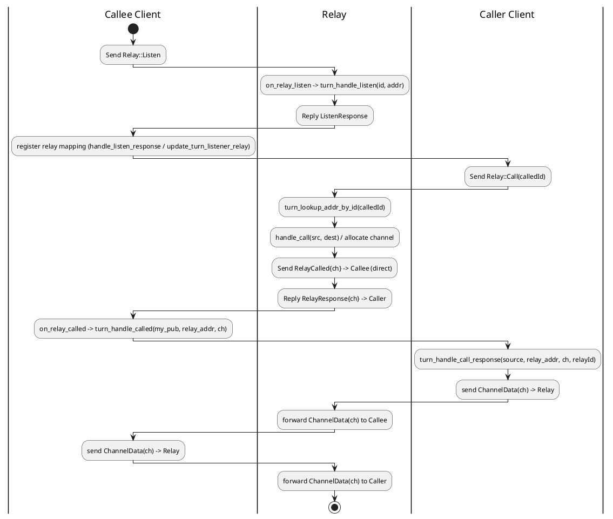

# TURN Call / Listen / Data Flow (Swimlanes)

This diagram summarizes the TURN call/listen/data transaction as implemented in this repository, aligned with the BINGLE spec (see generated/BINGLE_SPEC.md) and the code paths in:
- src/messages/handlers.rs (Relay handlers: on_relay_listen, on_relay_call, on_relay_called)
- src/turn/turn_relay_handler_impl.rs (relay-side TURN logic)
- src/turn/turn_client_handler_impl.rs (client-side TURN logic)
- src/api/bingle_api_impl.rs (send path that allocates relay channels)
- src/engine/mod.rs (TURN packet handling/forwarding in create_turn_handler)

Mermaid swimlanes (paste into Markdown viewers that support Mermaid):

```mermaid
flowchart TB
  %% Lanes
  subgraph Callee_Client[Client (callee)]
    L0[Send Relay::Listen to Relay]
    L1[Receive ListenResponse]
    L2[Register relay mapping (client):
       - handle_listen_response(relay_addr, relay_id)
       - or update_turn_listener_relay(relay_id, relay_addr)]
    L3[Receive RelayCalled{channel} from Relay]
    L4[Register mapping: handle_called(my_pub, relay_addr, ch)]
    L5[Send/recv data via TURN ChannelData(ch) with Relay]
  end

  subgraph Relay[Relay]
    R0[on_relay_listen(): turn_handle_listen(id, addr)]
    R1[on_relay_call():
       - turn_lookup_addr_by_id(calledId)
       - handle_call(src, dest) -> channel]
    R2[Send RelayCalled{channel} -> Callee (direct)]
    R3[Reply RelayResponse{channel} -> Caller]
    R4[Forward ChannelData(ch) between peers (Engine::create_turn_handler relay path)]
  end

  subgraph Caller_Client[Client (caller)]
    C0[Send Relay::Call(calledId) to Relay]
    C1[Receive RelayResponse{channel}]
    C2[Register mapping: handle_call_response(source, relay_addr, ch, relayId)]
    C3[Send/recv data via TURN ChannelData(ch) with Relay]
  end

  %% Listen setup
  L0 --> R0
  R0 --> L1
  L1 --> L2

  %% Call and channel allocation
  C0 --> R1
  R1 --> R2
  R2 --> L3
  L3 --> L4
  R1 --> R3
  R3 --> C1
  C1 --> C2

  %% Data transfer over TURN ChannelData
  C3 --> R4
  R4 --> L5
  L5 --> R4
  R4 --> C3
```

Key notes and mappings to code/spec:
- Listen (callee -> relay)
  - Message: Relay::Listen (BINGLE_SPEC.md: Relay Listen flow)
  - Handler: messages/handlers.rs::on_relay_listen → api.turn_handle_listen(id, src)
  - Relay state: turn_relay_handler_impl.rs::handle_listen stores id ↔ addr
  - Client bookkeeping: after ListenResponse, BingleApiImpl.update_turn_listener_relay registers the relay mapping for the local client instance
- Call (caller -> relay)
  - Message: Relay::Call(calledId)
  - Handler: messages/handlers.rs::on_relay_call
    - Lookup callee address via api.turn_lookup_addr_by_id(calledId)
    - Allocate/lookup channel via TurnRelayHandlerImpl::handle_call(src, dest)
    - Notify callee: send RelayCalled{channel} directly to callee (router sender with NetworkEndpoint::new_direct(dest))
    - Respond to caller: RelayResponse{channel}
- Client-side TURN registration
  - Callee: on RelayCalled → messages/handlers.rs::on_relay_called → api.turn_handle_called(my_pub, relay_addr, channel) → TurnClientHandlerImpl::handle_called
  - Caller: when allocating a relay channel inline during send (BingleApiImpl::send_message_to_network), successful RelayClient::call updates the endpoint (relay_channel/address) and then Engine.turn_client_handle_call_response registers client-side mapping
- Data transfer (TURN ChannelData)
  - Sender (client): wraps UDP payloads with ChannelData header (TurnClientHandlerImpl::send_turn_outgoing)
  - Relay: Engine::create_turn_handler (relay path) accepts ChannelData frames, resolves peer addresses via TurnRelayHandlerImpl, and forwards ChannelData unchanged to the opposite peer
  - Receiver (client): Engine::create_turn_handler (client path) unwraps and re-injects the stripped payload into the UDP mux using the appropriate NetworkEndpoint

PlantUML alternative (classic activity with partitions):



Implementation references:
- Relay listen: src/messages/handlers.rs::on_relay_listen, Engine/BingleApiInternal::turn_handle_listen → src/turn/turn_relay_handler_impl.rs::handle_listen
- Relay call: src/messages/handlers.rs::on_relay_call → turn_lookup_addr_by_id + handle_call, send RelayCalled then RelayResponse
- Client called: src/messages/handlers.rs::on_relay_called → BingleApiInternal::turn_handle_called → src/turn/turn_client_handler_impl.rs::handle_called
- Client call response: src/api/bingle_api_impl.rs::send_message_to_network → RelayClient::call → Engine::turn_client_handle_call_response
- TURN data path: src/engine/mod.rs::create_turn_handler (relay forwards ChannelData; client unwraps and reprocesses)

Notes:
- Channel numbers follow RFC 5766 (0x4000..0x7FFE). See TurnRelayHandlerImpl::alloc_channel.
- Both directions reuse the same channel for the (source, dest) pair by design in this codebase.
- The relay forwards ChannelData as-is between peers; the client unwraps before reprocessing.
